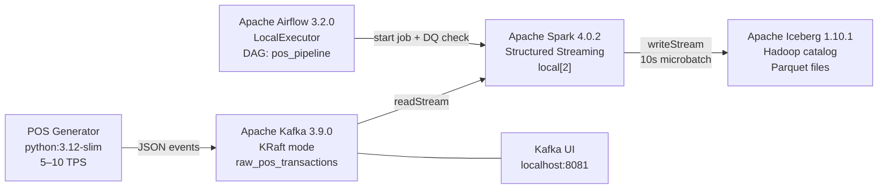

# Pure-Apache POS Streaming Pipeline

A portfolio project demonstrating production-grade data engineering using the Apache open-source ecosystem — built entirely on a local machine with zero cloud cost.

---

## Architecture



---

## Tech Stack

| Component | Version | Role |
|---|---|---|
| Apache Kafka | 3.9.0 (KRaft) | Event broker — no ZooKeeper |
| Apache Spark | 4.0.2 / PySpark | Structured Streaming processor |
| Apache Iceberg | 1.10.1 | Lakehouse table format (ACID + time-travel) |
| Apache Parquet | via Spark | Columnar storage under Iceberg |
| Apache Airflow | 3.2.0 | Workflow orchestration |
| Docker Compose | v2+ | Reproducible local stack |
| Python | 3.12+ | Generator, PySpark jobs, Airflow DAGs |
| WSL2 Ubuntu | 24.04 LTS | Linux kernel for Docker on Windows |

---

## Prerequisites

1. **Windows 10/11 with WSL2** — run `wsl --install` in PowerShell (installs Ubuntu 24.04 LTS)
2. **Docker Desktop** with WSL2 backend integration enabled
3. **VSCode** with the "Remote - WSL" extension
4. **16 GB RAM minimum** — allocate 10 GB to WSL via `C:\Users\<name>\.wslconfig`:

```ini
[wsl2]
memory=10GB
processors=4
swap=4GB
```

> **Important:** Keep the project inside the WSL filesystem (e.g. `~/projects/pos-pipeline`), not on `/mnt/c/`. Windows bind mounts have significantly worse Docker I/O performance and will slow Iceberg writes.

---

## Quick Start

```bash
# Clone inside WSL2
git clone <repo-url> ~/projects/pos-pipeline
cd ~/projects/pos-pipeline

# Copy environment template (edit if needed)
cp .env.example .env

# Create bind-mount directories
mkdir -p warehouse checkpoints

# Stage 1 only: Kafka + generator
docker compose up kafka kafka-ui generator

# Stage 2+: add Spark
docker compose up kafka kafka-ui generator spark

# Full stack (all stages)
docker compose up
```

---

## Service URLs

| Service | URL | Notes |
|---|---|---|
| Kafka UI | http://localhost:8081 | Topic browser, consumer lag |
| Airflow UI | http://localhost:8080 | admin / admin |
| Spark UI | http://localhost:4040 | Streaming query progress, DAG, batch timing |

---

## Development Stages

Build incrementally — each stage produces a working, testable component.

### Stage 1 — Kafka + POS Generator
```bash
docker compose up kafka kafka-ui generator
# Verify: open localhost:8081, confirm raw_pos_transactions topic filling
```

### Stage 2 — Spark to Parquet
```bash
# Switch to Parquet sink first to validate Kafka->Spark connection
WRITE_MODE=parquet docker compose up kafka generator spark
# Verify: ls warehouse/stage2_output/ — Parquet files appear every 10s
# Test fault tolerance: docker compose restart spark
# Spark resumes from checkpoint without reprocessing
```

### Stage 3 — Spark to Iceberg
```bash
docker compose up kafka generator spark  # WRITE_MODE=iceberg (default)

# Run the verification script for SQL screenshots
docker exec spark /opt/spark/bin/spark-submit /opt/spark/work-dir/verify_iceberg.py
```

Expected output includes: row counts, revenue by store, snapshot history,
time-travel query, ACID DELETE, and data quality assertions.

### Stage 4 — Airflow
```bash
docker compose up  # full stack
# Open localhost:8080, trigger pos_pipeline DAG manually
# Task 1: starts Spark job (succeeds immediately)
# Task 2: waits 15s, runs DQ assertions on Iceberg table
```

### Stage 5 — Full Integration
```bash
docker compose up  # cold start, all 7 services
```

All services healthy, events flowing, Iceberg table growing, DAG green.

---

## Resource Budget

| Service | Memory Limit | Notes |
|---|---|---|
| Kafka (KRaft) | 2 GB | Combined broker + controller |
| Spark | 3 GB | `spark.driver.memory=2g` + 512m overhead |
| Airflow Webserver | 1 GB | UI only |
| Airflow Scheduler | 1 GB | LocalExecutor — no Celery/Redis |
| PostgreSQL | 512 MB | Airflow metadata DB |
| Generator | 256 MB | Lightweight Python script |
| Kafka UI | 256 MB | Optional but recommended |
| **Total** | **~8 GB** | Within 10 GB WSL allocation |

---

## Design Decisions

### KRaft Mode (no ZooKeeper)
Apache Kafka 4.0 (March 2025) removed ZooKeeper support entirely. This project uses KRaft mode exclusively — a single container acts as both broker and controller. Any tutorial still referencing ZooKeeper is outdated.

### Hadoop Catalog for Iceberg
The Hadoop catalog writes metadata as files directly on the local filesystem alongside the data. For a single-writer, local-only project this is architecturally correct and requires zero extra containers. A production deployment would replace this with an Apache Polaris (REST catalog) server to support concurrent reads from multiple engines (Trino, DuckDB, etc.) and provide proper catalog versioning.

### Iceberg Hidden Partitioning
The table is partitioned by `days(transaction_timestamp)` and `store_id` using Iceberg's hidden partitioning feature. The partition logic is defined once in the table schema — queries don't need to filter on partition columns explicitly, and the physical layout can be changed without rewriting data.

### Airflow + Long-Running Streaming Jobs
Airflow is designed for finite, batch-style tasks that exit with a success or failure code. A Spark Structured Streaming job runs indefinitely. The pattern used here — `subprocess.Popen` + PID file — is the honest local-dev solution: the DAG task succeeds immediately after spawning the process, and a second task runs DQ assertions after one microbatch completes. In production the job would be submitted to YARN/Kubernetes and tracked by application ID via `SparkSubmitOperator`.

### confluent-kafka over kafka-python-ng
`confluent-kafka` is a thin Python binding over `librdkafka`, the C library that powers most production Kafka clients. It has full Kafka 4.x support, active maintenance, and is what hiring managers with production Kafka experience will recognize.

### Spark Memory Split (3 GB container / 2 GB heap)
The Docker container `mem_limit` is set to 3 GB while `spark.driver.memory` is 2 GB. The JVM heap must be smaller than the container limit to leave room for off-heap memory (Spark shuffle buffers), JVM metaspace, and OS overhead. Setting both to the same value causes Docker to OOM-kill the container.

---

## Verification Commands

```bash
# Check Kafka consumer lag
docker exec kafka /opt/kafka/bin/kafka-consumer-groups.sh \
  --bootstrap-server localhost:9092 --describe --all-groups

# Inspect Iceberg table files
ls -lh warehouse/db/pos_transactions/data/

# Run full Iceberg SQL demo
docker exec spark /opt/spark/bin/spark-submit /opt/spark/work-dir/verify_iceberg.py

# Trigger Airflow DAG via CLI
docker exec airflow-scheduler airflow dags trigger pos_pipeline
```

---

## Known Limitations (Intentional Portfolio Scope)

- **Single Kafka broker** — no replication. Sufficient for demonstrating the streaming pattern; production would use at least 3 brokers.
- **Spark local mode** — not a cluster. Demonstrates the streaming logic without the overhead of a YARN/K8s cluster.
- **5–10 TPS throughput** — intentionally throttled to prioritize architectural correctness over volume.
- **PID-file Airflow pattern** — appropriate for local development; not suitable for distributed production deployments.
